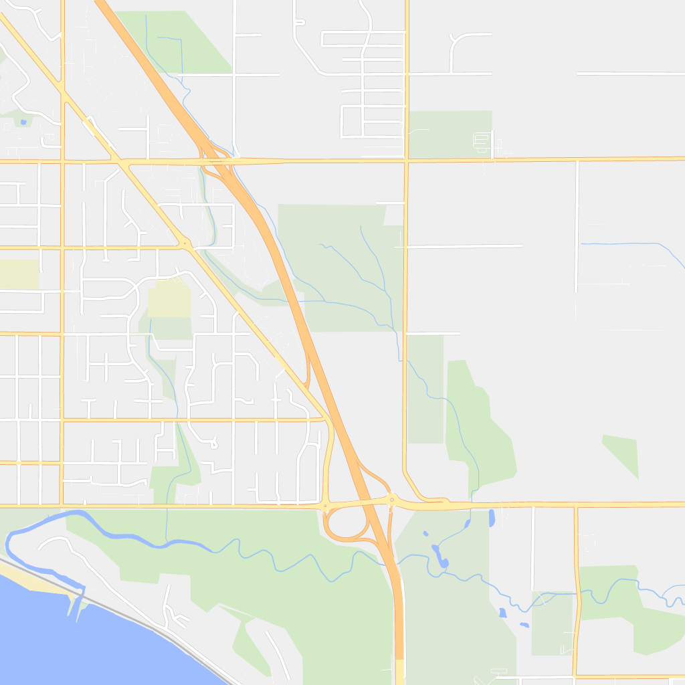

# dart_vector_tile_renderer

A vector tile renderer for use in creating map tile images or writing to a canvas.
Written in Dart to enable use of vector tiles with Flutter.

# Example

Here's an example of output:

